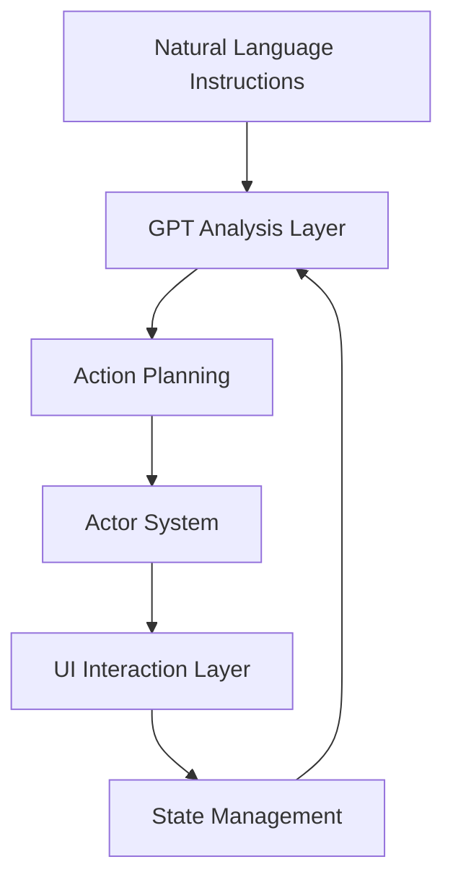

# 🤖 MacPilot - Advanced macOS UI Automation Framework

<div align="center">

[](https://github.com/adeelahmad/macpilot/stargazers)
[](LICENSE)
[](https://www.python.org)
[](https://www.apple.com/macos)
[](CONTRIBUTING.md)

**Native macOS UI Automation with GPT-Powered Intelligence**

[Key Features](#-key-features) •
[Architecture](#%EF%B8%8F-architecture) •
[Installation](#-installation) •
[Usage](#-usage) •
[Roadmap](#-roadmap) •
[Contributing](#-contributing)

</div>

## 🌟 What is MacPilot?

MacPilot is a state-of-the-art macOS UI automation framework that combines native Apple technologies with GPT intelligence to enable human-like interaction with your Mac. Write instructions in plain English, and let MacPilot handle the automation.

### Perfect For:
- 🔄 **Process Automation** - Automate repetitive UI tasks
- 🧪 **UI Testing** - Test macOS applications
- 🤖 **Desktop RPA** - Build robotic process automation
- 🔍 **Screen Analysis** - Extract data from UI elements
- 🧭 **Workflow Automation** - Create complex UI workflows

## ✨ Key Features

### 🧠 Core Intelligence
- **GPT Integration** - Natural language instruction processing
- **Vision Framework** - Advanced UI element detection
- **State Awareness** - Real-time system state tracking
- **Pattern Recognition** - Learned UI interaction patterns
- **Self-healing** - Automated error recovery

### 🎯 Native Integration
- **Apple Vision** - Native OCR and element detection
- **AppleScript** - Deep OS integration
- **Accessibility APIs** - Comprehensive UI control
- **Cocoa/AppKit** - Native macOS frameworks
- **Core Graphics** - Low-level screen capture

### 🛠 Developer Experience
- **Async Architecture** - Built on modern async Python
- **Type Safety** - Full Pydantic validation
- **Actor System** - Modular action execution
- **State Management** - Comprehensive UI state tracking
- **Pattern System** - Reusable interaction patterns

### 🔄 Application Control
- **Chrome Control** - Deep browser automation
- **Finder Operations** - File system automation
- **System Control** - OS-level operations
- **Menu Navigation** - Application menu control
- **Window Management** - Window state control

## 🏗️ Architecture



### Core Components:
1. **Instruction Processing** - GPT-powered instruction analysis
2. **State Management** - UI state tracking and validation
3. **Actor System** - Modular action execution
4. **Pattern System** - Reusable interaction patterns
5. **Vision System** - UI element detection and OCR
6. **Recovery System** - Automated error handling

## 🚀 Installation

```bash
# Install from PyPI
pip install macpilot

# Or install from source
git clone https://github.com/adeelahmad/macpilot.git
cd macpilot
pip install -e .
```

## 📝 Usage

### Basic Example
```python
from macpilot import MacPilot

async def main():
    pilot = MacPilot()

    # Simple automation
    await pilot.execute("Open Chrome and search for 'Python tutorials'")

    # Complex workflows
    await pilot.execute("""
        1. Find all PDFs in Downloads
        2. Create a folder named 'Documents'
        3. Move PDFs older than 30 days
        4. Create a summary spreadsheet
    """)

if __name__ == "__main__":
    asyncio.run(main())
```

### Pattern Example
```python
from macpilot.patterns import register_pattern

@register_pattern("login_flow")
async def handle_login(username: str, password: str):
    return [
        {"action": "click", "target": "username_field"},
        {"action": "type", "text": username},
        {"action": "click", "target": "password_field"},
        {"action": "type", "text": password},
        {"action": "click", "target": "login_button"}
    ]
```

## 📋 Todo & Roadmap

### High Priority
- [ ] User Interface
  - [ ] CLI tool for automation scripts
  - [ ] Web dashboard for monitoring
  - [ ] Visual workflow builder

- [ ] Core Features
  - [ ] Local LLM support
  - [ ] Improved error recovery
  - [ ] Performance optimizations

### Medium Priority
- [ ] Documentation
  - [ ] API reference
  - [ ] Pattern library
  - [ ] Example gallery

- [ ] Testing
  - [ ] Increase test coverage
  - [ ] Integration tests
  - [ ] Performance benchmarks

### Low Priority
- [ ] Additional Features
  - [ ] Safari automation support
  - [ ] Network request monitoring
  - [ ] Advanced screen recording
  - [ ] Workflow marketplace

## 🤝 Contributing

Contributions are welcome! Areas we're focusing on:

- 📝 Documentation improvements
- 🧪 Testing and bug fixes
- 🎯 New application actors
- 🔄 Pattern implementations
- 🐛 Performance optimizations

Check our [Contributing Guide](CONTRIBUTING.md) for details.

## 📜 License

MacPilot is MIT licensed. See [LICENSE](LICENSE) for details.

## 🙏 Acknowledgments

- Apple for macOS APIs
- OpenAI for GPT models
- Python community

<div align="center">

Made with ❤️ by the MacPilot Team

[🌐 Website](https://macpilot.dev) •
[📖 Documentation](https://docs.macpilot.dev) •
[💬 Discord](https://discord.gg/macpilot)

</div>
